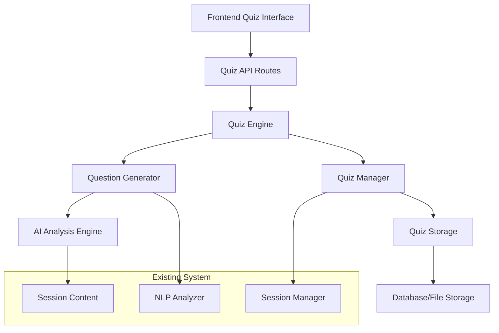

# AI Quiz System Design Document

## Overview

The AI Quiz System is a comprehensive feature that generates personalized quizzes based on uploaded document content. Each study session will have its own quiz pool, allowing users to take unlimited quiz attempts with dynamically generated questions. The system integrates seamlessly with the existing document analysis workflow and provides detailed performance tracking.

## Architecture

### High-Level Architecture



### Component Integration

The AI Quiz System integrates with existing components:

- **Session Manager**: Retrieves session content for quiz generation
- **NLP Analyzer**: Analyzes content to create intelligent questions
- **Database Layer**: Stores quiz attempts and results
- **Frontend History**: Displays quiz options and results

## Components and Interfaces

### 1. Quiz Engine (`backend/ai_engine/quiz_engine.py`)

Core component responsible for quiz generation and management.

```python
class QuizEngine:
    def generate_quiz_pool(self, session_id: str) -> QuizPool
    def create_quiz_instance(self, session_id: str, user_id: str) -> QuizInstance
    def submit_quiz_answers(self, quiz_instance_id: str, answers: List[Answer]) -> QuizResult
    def get_quiz_history(self, session_id: str, user_id: str) -> List[QuizResult]
```

### 2. Question Generator (`backend/ai_engine/question_generator.py`)

AI-powered component for creating diverse question types.

```python
class QuestionGenerator:
    def generate_questions_from_content(self, content: str, count: int = 50) -> List[QuizQuestion]
    def create_multiple_choice(self, topic: str, difficulty: str) -> MultipleChoiceQuestion
    def create_true_false(self, statement: str) -> TrueFalseQuestion
    def create_short_answer(self, concept: str) -> ShortAnswerQuestion
```

### 3. Quiz Manager (`backend/utils/quiz_manager.py`)

Handles quiz persistence and retrieval operations.

```python
class QuizManager:
    def save_quiz_pool(self, session_id: str, quiz_pool: QuizPool) -> bool
    def get_quiz_pool(self, session_id: str) -> QuizPool
    def save_quiz_attempt(self, quiz_result: QuizResult) -> str
    def get_quiz_attempts(self, session_id: str, user_id: str) -> List[QuizResult]
```

### 4. Quiz API Routes (`backend/routes/quiz.py`)

RESTful endpoints for quiz operations.

```python
@router.post("/quiz/generate/{session_id}")
@router.post("/quiz/start/{session_id}")
@router.post("/quiz/submit/{quiz_instance_id}")
@router.get("/quiz/history/{session_id}")
@router.get("/quiz/result/{quiz_instance_id}")
```

### 5. Frontend Quiz Components

#### QuizInterface (`frontend/src/components/QuizInterface.jsx`)

- Displays quiz questions with interactive elements
- Handles answer submission and navigation
- Shows progress and timer

#### QuizHistory (`frontend/src/components/QuizHistory.jsx`)

- Displays past quiz attempts and scores
- Integrates with existing History page
- Provides quick access to retake quizzes

## Data Models

### Quiz Pool Schema

```python
class QuizPool(BaseModel):
    session_id: str
    questions: List[QuizQuestion] = []
    generated_at: datetime
    total_questions: int
    difficulty_distribution: Dict[str, int]

class QuizQuestion(BaseModel):
    id: str
    question_text: str
    question_type: QuestionType  # multiple_choice, true_false, short_answer
    options: Optional[List[str]] = None  # For multiple choice
    correct_answer: str
    explanation: str
    difficulty: DifficultyLevel  # easy, medium, hard
    topic: str
    marks: int = 1
```

### Quiz Instance Schema

```python
class QuizInstance(BaseModel):
    id: str
    session_id: str
    user_id: str
    questions: List[QuizQuestion]
    started_at: datetime
    status: QuizStatus  # in_progress, completed, abandoned
    time_limit: Optional[int] = 1800  # 30 minutes default

class QuizResult(BaseModel):
    quiz_instance_id: str
    session_id: str
    user_id: str
    answers: List[Answer]
    score: float
    total_questions: int
    correct_answers: int
    completed_at: datetime
    time_taken: int  # seconds
    performance_breakdown: Dict[str, float]
```

### Answer Schema

```python
class Answer(BaseModel):
    question_id: str
    user_answer: str
    is_correct: bool
    time_spent: int  # seconds

class QuestionType(str, Enum):
    MULTIPLE_CHOICE = "multiple_choice"
    TRUE_FALSE = "true_false"
    SHORT_ANSWER = "short_answer"

class DifficultyLevel(str, Enum):
    EASY = "easy"
    MEDIUM = "medium"
    HARD = "hard"

class QuizStatus(str, Enum):
    IN_PROGRESS = "in_progress"
    COMPLETED = "completed"
    ABANDONED = "abandoned"
```

## AI Question Generation Strategy

### Content Analysis Pipeline

1. **Topic Extraction**: Identify key concepts and themes from session documents
2. **Difficulty Assessment**: Analyze content complexity to determine question difficulty
3. **Question Type Selection**: Choose appropriate question formats based on content type
4. **Distractor Generation**: Create plausible incorrect options for multiple choice questions

### Question Generation Algorithms

#### Multiple Choice Questions

- Extract key facts and concepts
- Generate 3-4 plausible distractors using semantic similarity
- Ensure one clearly correct answer

#### True/False Questions

- Identify factual statements from content
- Create variations with subtle modifications
- Balance true and false questions

#### Short Answer Questions

- Focus on definitions, explanations, and processes
- Generate questions requiring 1-3 sentence responses
- Include keyword-based scoring

### Quality Assurance

- **Relevance Scoring**: Ensure questions relate to session content
- **Difficulty Balancing**: Maintain appropriate difficulty distribution
- **Duplicate Detection**: Prevent similar questions in same quiz
- **Answer Validation**: Verify correct answers are unambiguous

## Error Handling

### Quiz Generation Errors

```python
class QuizGenerationError(Exception):
    """Raised when quiz generation fails"""
    pass

class InsufficientContentError(QuizGenerationError):
    """Raised when session content is insufficient for quiz generation"""
    pass

class QuestionGenerationError(QuizGenerationError):
    """Raised when AI fails to generate quality questions"""
    pass
```

### Error Recovery Strategies

1. **Fallback Question Pool**: Maintain generic questions for content-poor sessions
2. **Partial Generation**: Generate fewer questions if full set fails
3. **Retry Logic**: Attempt regeneration with different parameters
4. **User Notification**: Inform users of generation limitations

### API Error Responses

```json
{
  "error": "quiz_generation_failed",
  "message": "Unable to generate quiz from session content",
  "details": {
    "session_id": "session_123",
    "reason": "insufficient_content",
    "suggestions": ["Upload more detailed documents", "Try a different session"]
  }
}
```

## Testing Strategy

### Unit Tests

1. **Question Generator Tests**

   - Test question generation for different content types
   - Validate question quality and format
   - Test error handling for edge cases

2. **Quiz Engine Tests**

   - Test quiz pool creation and management
   - Validate quiz instance generation
   - Test scoring algorithms

3. **Quiz Manager Tests**
   - Test data persistence operations
   - Validate quiz retrieval functionality
   - Test concurrent access scenarios

### Integration Tests

1. **End-to-End Quiz Flow**

   - Test complete quiz generation to submission workflow
   - Validate data consistency across components
   - Test error propagation and recovery

2. **API Integration Tests**
   - Test all quiz-related endpoints
   - Validate request/response formats
   - Test authentication and authorization

### Performance Tests

1. **Quiz Generation Performance**

   - Test generation time for various content sizes
   - Validate memory usage during generation
   - Test concurrent quiz generation

2. **Database Performance**
   - Test quiz storage and retrieval performance
   - Validate query optimization for history retrieval
   - Test scalability with large numbers of quiz attempts

### Frontend Tests

1. **Component Tests**

   - Test quiz interface interactions
   - Validate answer submission and navigation
   - Test responsive design across devices

2. **User Experience Tests**
   - Test quiz flow usability
   - Validate accessibility compliance
   - Test performance on various browsers

## Security Considerations

### Data Protection

- Encrypt quiz answers and results in storage
- Implement secure session management for quiz instances
- Validate all user inputs to prevent injection attacks

### Access Control

- Ensure users can only access their own quiz results
- Implement proper session validation for quiz attempts
- Prevent unauthorized quiz generation or modification

### Rate Limiting

- Limit quiz generation requests per user/session
- Implement cooldown periods for quiz retakes
- Monitor for abuse patterns and implement protections

## Performance Optimization

### Caching Strategy

- Cache generated quiz pools for faster quiz creation
- Implement Redis caching for frequently accessed quiz data
- Cache AI model responses to reduce generation time

### Database Optimization

- Index quiz tables for efficient history queries
- Implement pagination for large quiz history sets
- Use database partitioning for quiz results by date

### AI Model Optimization

- Batch question generation requests when possible
- Implement model response caching
- Use lightweight models for simple question types

## Monitoring and Analytics

### Quiz Metrics

- Track quiz completion rates by session
- Monitor question difficulty effectiveness
- Analyze user performance patterns

### System Metrics

- Monitor quiz generation success rates
- Track API response times and error rates
- Monitor database performance for quiz operations

### User Analytics

- Track user engagement with quiz feature
- Analyze quiz retake patterns
- Monitor user satisfaction through completion rates
